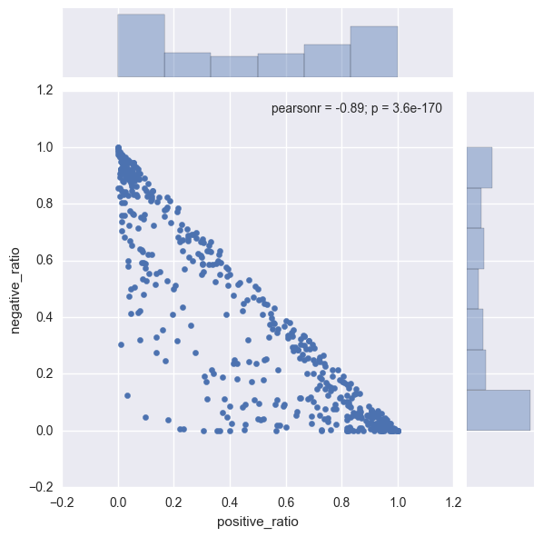
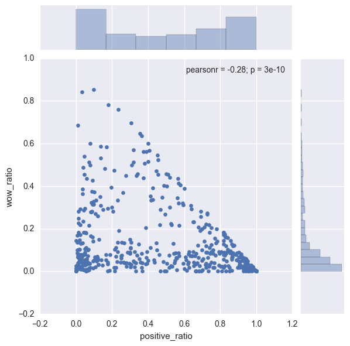
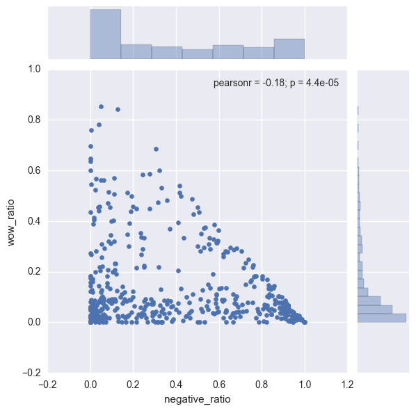
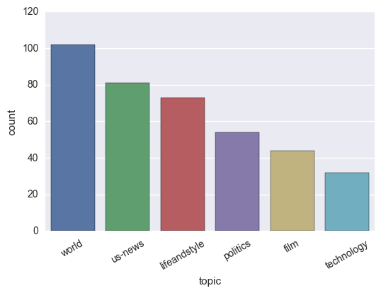
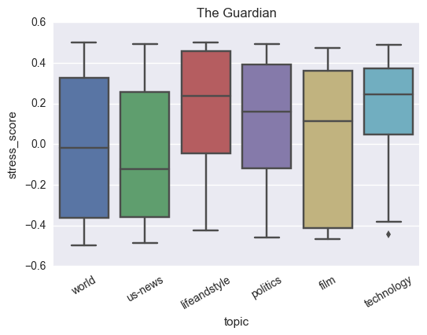

# Influence of News Topics on Facebook-based Stress Impact Scores


## Table of Contents

1. [Introduction](#introduction)

2. [Related Work](#related-work)

3. [Setup](#setup)

4. [Data Collection](#data-collection)

5. [Data Analysis](#data-analysis)    
   5.1 [Reaction Bi-Variate Analysis](#reaction-analysis)    
   5.2 [Stress Score Analysis](#stress-score-analysis)

6. [Conclusion](#conclusion)

<a id ="introduction"></a>

## 1. Introduction

The amount of time people spend on social media for e.g., Facebook, Twitter etc. is constantly increasing. Teens now spend up to nine hours a day on social platforms, while 30% of all time spent online is now allocated to social media interaction. And the majority of that time is on mobile - 60% of social media time spent is facilitated by a mobile device. [Source](https://www.socialmediatoday.com/marketing/how-much-time-do-people-spend-social-media-infographic)

With such widespread use of smartphones, the role of social networking websites has greatly transformed. Becoming popular as a fun way to share your vacation pictures with the world, Facebook feed has now turned into a one-stop destination for everything from creepily relevant advertisements to latest news on violence and destruction around the world. How many times have you logged into Facebook with the intention of checking updates from dear ones only to find unpleasant news of politics and violence on top of your news feed?

Negative news can significantly change an individual’s mood leading to distress and degradation in productivity. In this project, I analyze the potential stress impact of articles shared on Facebook and the variance of this impact based on the broad topic of the news article. Intuitively, an article on violence/war is expected to induce a more negative reaction compared to an article on sports/lifestyle. My initial goal is to validate such hypotheses using Facebook data available publicly. If we do observe significant variations based on news topics, we can potentially incorporate the topic dimension into news recommendation engines. For example, during working hours, the recommendation engine can place low priority for negative news with high stress scores if previous activity by the user for similar news articles is not found.

For the data collection, I utilize Facebook API to collect information including article link, likes and "reactions" information to news articles shared on the official pages of reputed newspapers around the world. Additionally, for each news article, I find out the broad topic category of the article either from the article's link or by scraping the article's main page. With the collected data, I perform various analyses including relationship between the negative and positive reactions to an article and the variance in stress score across news topics.

For those unfamiliar with Facebook reactions, these are additional emotions one can express for photos, posts and other content on Facebook apart from the "like" option which was the only reaction present previously. The available reactions are shown in the figure below the title.

<a id ="related-work"></a>

## 2. Related Work

While researching during problem formulation of this project, I came across this highly relevant data science blog [MyChillNews: An NLP-driven guide for conscious consumption of stressful news](https://blog.insightdatascience.com/mychillnews-an-nlp-driven-guide-for-conscious-consumption-of-stressful-news-89b4ba78a937). In MyChillNews, the author computed Stress-Impact Scores for news articles using Facebook API data. The author trained machine learning models for stress impact prediction using the article's title words as predictors. Moreover, the author built a web app that scrapes the top headlines from various newspapers' main pages on a daily basis and computes the potential Stress Impact Score using the trained models. All in all, this is a fantastic project and served as motivation for my own analysis.

I found the analysis or active incorporation of news topic into the prediction model to be missing. It is possible a strong machine learning model can self-learn to classify topics based on words in the article titles. In contrast, my goal is to analyze the variance in stress impact scores across news topics without the use of article's title and content.

<a id ="setup"></a>

## 3. Setup


```python
# Data Collection
import urllib.request
import json
import datetime
import csv
import time
import requests
from bs4 import BeautifulSoup

# Data Transformation and Analysis
import numpy as np
import pandas as pd
pd.set_option('precision',10)

# Plotting
import matplotlib
import matplotlib.pyplot as plt
plt.rcParams['figure.figsize'] = [14,10]
import seaborn as sns
%matplotlib inline
```

<a id ="data-collection"></a>

## 4. Data Collection

For the data collection via Python using Facebook API, I was able to find baseline code available on GitHub. The top three sources I utilized are as follows:

1. [Facebook Page Post Scraper](https://github.com/minimaxir/facebook-page-post-scraper)

2. [MyChillNews](https://github.com/drsaunders/MyChillNews)

The key extensions I performed include:

1. **Extraction of news topics from news article links.** The treatment had to be different for different newspapers. Please go through the __processFacebookPageFeedStatus function of NewspaperData class in the following cell.

2. **Modified computation of stress impact score compared to MyChillNews.** In my definition of stress score, the numerator is the sum of loves, hahas and thankfuls minus the sum of sad and angries. The denominator is the sum of loves, hahas, thankfuls, sads, angries and wows. I decided not to use wows in the numerator as from my anectodal evidence, wow can be used for both positive news and negative news.

3. Minor changes in requests response code and other changes for Python 3.


<a id ="data-analysis"></a>

## 5. Data Analysis

In this sub-section, I analyze the collected data. First, I filter the dataframe by removing topics for which there are less than 25 articles and records with total number of reactions less than 10.


```python
guardian_data.head()
```


<div>
<table border="1" class="dataframe">
  <thead>
    <tr style="text-align: right;">
      <th></th>
      <th>link_name</th>
      <th>num_angries</th>
      <th>num_comments</th>
      <th>num_hahas</th>
      <th>num_likes</th>
      <th>num_loves</th>
      <th>num_reactions</th>
      <th>num_sads</th>
      <th>num_shares</th>
      <th>num_thankfuls</th>
      <th>num_wows</th>
      <th>status_id</th>
      <th>status_link</th>
      <th>status_message</th>
      <th>status_published</th>
      <th>status_type</th>
      <th>stress_score</th>
      <th>topic</th>
    </tr>
  </thead>
  <tbody>
    <tr>
      <th>0</th>
      <td>b"A year on from Trump's pussy grab, nothing h...</td>
      <td>47</td>
      <td>42</td>
      <td>11</td>
      <td>90</td>
      <td>3</td>
      <td>169</td>
      <td>18</td>
      <td>40</td>
      <td>0</td>
      <td>0</td>
      <td>10513336322_10156114478206323</td>
      <td>https://www.theguardian.com/lifeandstyle/2017/...</td>
      <td>b'"It is one year later, and all that\'s diffe...</td>
      <td>2017-10-29 17:00:00</td>
      <td>link</td>
      <td>-0.3227848101</td>
      <td>lifeandstyle</td>
    </tr>
    <tr>
      <th>1</th>
      <td>b'Has America lost its appetite for Curb Your ...</td>
      <td>23</td>
      <td>249</td>
      <td>46</td>
      <td>186</td>
      <td>9</td>
      <td>272</td>
      <td>7</td>
      <td>33</td>
      <td>0</td>
      <td>1</td>
      <td>10513336322_10156114047201323</td>
      <td>https://www.theguardian.com/tv-and-radio/2017/...</td>
      <td>b'Has a show about the travails of a privilege...</td>
      <td>2017-10-29 16:40:00</td>
      <td>link</td>
      <td>0.1453488372</td>
      <td>tv-and-radio</td>
    </tr>
    <tr>
      <th>2</th>
      <td>b'Why we need a 21st-century Martin Luther to ...</td>
      <td>2</td>
      <td>50</td>
      <td>18</td>
      <td>340</td>
      <td>14</td>
      <td>379</td>
      <td>2</td>
      <td>182</td>
      <td>0</td>
      <td>3</td>
      <td>10513336322_10156114322666323</td>
      <td>https://www.theguardian.com/technology/2017/oc...</td>
      <td>b"'We are all members of the Church of Technop...</td>
      <td>2017-10-29 16:20:00</td>
      <td>link</td>
      <td>0.3589743590</td>
      <td>technology</td>
    </tr>
    <tr>
      <th>3</th>
      <td>b"Sasha Velour: 'Drag is darkness turned into ...</td>
      <td>5</td>
      <td>201</td>
      <td>6</td>
      <td>1205</td>
      <td>368</td>
      <td>1589</td>
      <td>1</td>
      <td>155</td>
      <td>0</td>
      <td>4</td>
      <td>10513336322_10156114348701323</td>
      <td>https://www.theguardian.com/tv-and-radio/2017/...</td>
      <td>b'Sasha Velour: "As an adult I\'ve turned to d...</td>
      <td>2017-10-29 16:00:00</td>
      <td>link</td>
      <td>0.4791666667</td>
      <td>tv-and-radio</td>
    </tr>
    <tr>
      <th>4</th>
      <td>b'Frida Kahlo: feminist, selfie queen, queer i...</td>
      <td>4</td>
      <td>206</td>
      <td>21</td>
      <td>3343</td>
      <td>525</td>
      <td>3895</td>
      <td>0</td>
      <td>715</td>
      <td>0</td>
      <td>3</td>
      <td>10513336322_10156114421836323</td>
      <td>https://www.theguardian.com/fashion/2017/oct/2...</td>
      <td>b'"Frida Kahlo was one of the first women to u...</td>
      <td>2017-10-29 15:40:00</td>
      <td>link</td>
      <td>0.4900542495</td>
      <td>fashion</td>
    </tr>
  </tbody>
</table>
</div>


```python
guardian_data.info()
```

    <class 'pandas.core.frame.DataFrame'>
    RangeIndex: 821 entries, 0 to 820
    Data columns (total 18 columns):
    link_name           821 non-null object
    num_angries         821 non-null int64
    num_comments        821 non-null int64
    num_hahas           821 non-null int64
    num_likes           821 non-null int64
    num_loves           821 non-null int64
    num_reactions       821 non-null int64
    num_sads            821 non-null int64
    num_shares          821 non-null int64
    num_thankfuls       821 non-null int64
    num_wows            821 non-null int64
    status_id           821 non-null object
    status_link         821 non-null object
    status_message      821 non-null object
    status_published    821 non-null object
    status_type         821 non-null object
    stress_score        821 non-null float64
    topic               821 non-null object
    dtypes: float64(1), int64(10), object(7)
    memory usage: 115.5+ KB


```python
# Making a copy on which we will perform the transformations

news_df = guardian_data.copy()
```


```python
# Removing the records with number of reactions less than 10
# Total number of reactions includes the likes so they have to be removed

news_df = (news_df
           .loc[news_df['num_reactions'] -
                news_df['num_likes'] >= 10,:])
```


```python
# Removing rows with topics which have a total number of articles less than 25

news_df = (news_df.groupby(['topic'])
              .filter(lambda x: len(x) >= 25))
```

<a id ="reaction-analysis"></a>

### 5.1 Reaction Analysis

In this sub-section, we analyze the relationship between the different reactions after classifying them into positive and negative reactions. Also, I validate not using "wow" in the Stress score computation by showing that it does not have significant correlation with either positive reaction ratio or negative reaction ratio.

To analyze the relationship between positive reactions and negative reactions, I first compute positive reaction ratio and negative reaction ratio for each record. In short, they are the fractions of the total reactions on the record.


```python
news_df['positive_ratio'] = ((news_df['num_hahas'] +
                                         news_df['num_loves'] +
                                         news_df['num_thankfuls']) / (news_df['num_reactions'] - news_df['num_likes']))

news_df['negative_ratio'] = (news_df['num_sads'] + news_df['num_angries']) / (news_df['num_reactions'] - news_df['num_likes'])

news_df['wow_ratio'] = news_df['num_wows'] / (news_df['num_reactions'] - news_df['num_likes'])
```


```python
# Positive Reaction ratio - Negative Reaction ratio
# Bi-variate relationship

sns.jointplot(x = "positive_ratio", y = "negative_ratio", data = news_df)
```


    <seaborn.axisgrid.JointGrid at 0x1100427f0>





**Observations:**

1. **Positive reaction distribution:** The biggest bars in the bar plot are at extremely low value of 0 or extremely high value of 1.
2. ** Negative reaction distribution:** The highest bar is at 0 and evenly distributed across other ratio values.
3. **Strong negative correlation:** The Pearson correlation coefficient is a high value of -0.89. From the distribution curves, majority of the points have high positive reaction score or high negative reaction score.

Next, I show wow reaction has little correlation with either the positive reaction ratio or negative reaction ratio.


```python
sns.jointplot(x = "positive_ratio", y = "wow_ratio", data = news_df)
```


    <seaborn.axisgrid.JointGrid at 0x110020940>





```python
sns.jointplot(x = "negative_ratio", y = "wow_ratio", data = news_df)
```


    <seaborn.axisgrid.JointGrid at 0x1108a2550>





<a id ="stress-score-analysis"></a>

## 5.2 Stress Score Analysis


```python
# Listing the top topics based on article count
top_topics = (news_df['topic']
              .value_counts()
              .sort_values(ascending = False)
              .head(10))

top_topics
```


    commentisfree    112
    world            102
    us-news           81
    lifeandstyle      73
    politics          54
    film              44
    technology        32
    Name: topic, dtype: int64


commentisfree seems to an irrelevant topic and therefore will be removed from further analysis.


```python
news_df = news_df.loc[news_df['topic'] != 'commentisfree',:]
```


```python
news_df['topic'].value_counts()
```


    world           102
    us-news          81
    lifeandstyle     73
    politics         54
    film             44
    technology       32
    Name: topic, dtype: int64


```python
g = sns.countplot(x = "topic", data = news_df,
              order = (news_df['topic'].
                       value_counts().index))
g.set_xticklabels(g.get_xticklabels(),rotation=30)
```


    [<matplotlib.text.Text at 0x111494390>,
     <matplotlib.text.Text at 0x1114a6cc0>,
     <matplotlib.text.Text at 0x11149c860>,
     <matplotlib.text.Text at 0x110ee0278>,
     <matplotlib.text.Text at 0x111497898>,
     <matplotlib.text.Text at 0x111500f28>]





```python
g = sns.boxplot(x = "topic", y = "stress_score", data = news_df,
              order = (news_df['topic'].
                       value_counts().
                       iloc[:].index))
g.set_xticklabels(g.get_xticklabels(),rotation=30)
plt.title("The Guardian")
```


    <matplotlib.text.Text at 0x11171df98>





**Observations:**

1. Technology and Lifestyle topics have the highest positive scores indicating a positive reaction from the readers/

2. Interestingly, politics also has a positive score.

3. Interestingly, film news has the highest variance with the 25%-quantile point lying at -0.4.

4. US News has the lowest mean stress score indicating a higher probability of negative news compared to others. With the US-related news being largely negative ever since the recent elections, this is not surprising.

I performed similar analysis for also LA Times. This will allow us to compare the stress score across news agencies. The plot similar to above is displayed below.


<a id ="conclusion"></a>

## 6. Conclusion

In conclusion, I analyzed Facebook reaction data for news articles shared on the official pages of leading newspapers. My analysis shows a strong negative correlation between positive reaction ratio and negative reaction ratio for an article. Moreover, significant variance was observed in stress score across the different news topics!


```python

```

## LICENSE

Open sourced under the [MIT License](LICENSE.md)
